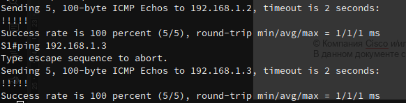

# STP. Развертывание коммутируемой сети с резервными каналами

## Цель
 - Создание сети и настройка основных параметров устройства.
 - Выбор корневого моста.
 - Наблюдение за процессом выбора протоколом STP порта, исходя из стоимости портов.
 - Наблюдение за процессом выбора протоколом STP порта, исходя из приоритета портов.

## Описание/Пошаговая инструкция выполнения домашнего задания:
### В этой лабораторной работе вам предстоит настроить протокол STP

1. В части 1 вам предстоит настроить топологию сети и основные параметры маршрутизаторов.
2. В части 2 Для каждого экземпляра протокола spanning-tree (коммутируемая сеть LAN или широковещательный домен) существует коммутатор, выделенный в качестве корневого моста.
3. В части 3 Наблюдение за процессом выбора протоколом STP порта, исходя из стоимости портов.
4. В части 4 вам предстоит активировать избыточные пути до каждого из коммутаторов, чтобы просмотреть, каким образом протокол STP выбирает порт с учетом приоритета портов.


## Результат

### Часть 1:	Создание сети и настройка основных параметров устройства

В этой части выполнена настрока топологии сети и основные параметры коммутаторов. В результате была проверена работоспособность стенда: все коммутаторы "видели" друг друга.  
Пример:  



### Часть 2:	Определение корневого моста

В этой части мы определили root bridge и роли портов на коммутаторах.

#### Коммутатор S1

```
S1(config)#do sh spanning-tree 

VLAN0001
  Spanning tree enabled protocol ieee
  Root ID    Priority    32769
             Address     aabb.cc00.1000
             This bridge is the root
             Hello Time   2 sec  Max Age 20 sec  Forward Delay 15 sec

  Bridge ID  Priority    32769  (priority 32768 sys-id-ext 1)
             Address     aabb.cc00.1000
             Hello Time   2 sec  Max Age 20 sec  Forward Delay 15 sec
             Aging Time  300 sec

Interface           Role Sts Cost      Prio.Nbr Type
------------------- ---- --- --------- -------- --------------------------------
Et0/1               Desg FWD 100       128.2    Shr 
Et0/3               Desg FWD 100       128.4    Shr 
```

#### Коммутатор S2

```
S2(config)#do sh spanning-tree 

VLAN0001
  Spanning tree enabled protocol ieee
  Root ID    Priority    32769
             Address     aabb.cc00.1000
             Cost        100
             Port        2 (Ethernet0/1)
             Hello Time   2 sec  Max Age 20 sec  Forward Delay 15 sec

  Bridge ID  Priority    32769  (priority 32768 sys-id-ext 1)
             Address     aabb.cc00.2000
             Hello Time   2 sec  Max Age 20 sec  Forward Delay 15 sec
             Aging Time  300 sec

Interface           Role Sts Cost      Prio.Nbr Type
------------------- ---- --- --------- -------- --------------------------------
Et0/1               Root FWD 100       128.2    Shr 
Et0/3               Desg FWD 100       128.4    Shr 
```

#### Коммутатор S3

```
S3(config)#do sh spanning-tree 

VLAN0001
  Spanning tree enabled protocol ieee
  Root ID    Priority    32769
             Address     aabb.cc00.1000
             Cost        100
             Port        4 (Ethernet0/3)
             Hello Time   2 sec  Max Age 20 sec  Forward Delay 15 sec

  Bridge ID  Priority    32769  (priority 32768 sys-id-ext 1)
             Address     aabb.cc00.3000
             Hello Time   2 sec  Max Age 20 sec  Forward Delay 15 sec
             Aging Time  15  sec

Interface           Role Sts Cost      Prio.Nbr Type
------------------- ---- --- --------- -------- --------------------------------
Et0/1               Altn BLK 100       128.2    Shr 
Et0/3               Root LRN 100       128.4    Shr 
```

### Ответы на вопросы по второй части:

С учетом выходных данных, поступающих с коммутаторов, ответьте на следующие вопросы.
1. *Какой коммутатор является корневым мостом?*  
**S1**
2. *Почему этот коммутатор был выбран протоколом spanning-tree в качестве корневого моста?*  
**По наименьшему bid** 
3. *Какие порты на коммутаторе являются корневыми портами?*  
**S2: et0/1; S3: et0/3**
4. *Какие порты на коммутаторе являются назначенными портами?*  
**S1: et0/1, et0/3;  S2: et0/3**
5. *Какой порт отображается в качестве альтернативного и в настоящее время заблокирован?*  
**S3: et0/1**
6. *Почему протокол spanning-tree выбрал этот порт в качестве невыделенного (заблокированного) порта?*  
**т.к. bid противоложной стороны (S2) ниже** 


## Часть 3:	Наблюдение за процессом выбора протоколом STP порта, исходя из стоимости портов

Здесь мы определили порт с заблокированным портом - S3: et0/1. Затем изменили стоимость root-порта на этом коммутаторе (понизили), и увидели, что порт S3: et0/1 стал уже назначенным:
```
S3(config)#do sh spanning-tree 

VLAN0001
  Spanning tree enabled protocol ieee
  Root ID    Priority    32769
             Address     aabb.cc00.1000
             Cost        90
             Port        4 (Ethernet0/3)
             Hello Time   2 sec  Max Age 20 sec  Forward Delay 15 sec

  Bridge ID  Priority    32769  (priority 32768 sys-id-ext 1)
             Address     aabb.cc00.3000
             Hello Time   2 sec  Max Age 20 sec  Forward Delay 15 sec
             Aging Time  15  sec

Interface           Role Sts Cost      Prio.Nbr Type
------------------- ---- --- --------- -------- --------------------------------
Et0/1               Desg FWD 100       128.2    Shr 
Et0/3               Root FWD 90        128.4    Shr 
```

Порт поменял свою роль т.к. теперь этот коммутатор стал "более дешевым" по стоимости при достижении root bridge, а root path cost имеет приоритет над bid.

## Часть 4:	Наблюдение за процессом выбора протоколом STP порта, исходя из приоритета портов

В этой части мы включили вторые линки между коммутаторами и определили все статусы портов:

#### Коммутатор S1

```
S1#sh spanning-tree 

VLAN0001
  Spanning tree enabled protocol ieee
  Root ID    Priority    32769
             Address     aabb.cc00.1000
             This bridge is the root
             Hello Time   2 sec  Max Age 20 sec  Forward Delay 15 sec

  Bridge ID  Priority    32769  (priority 32768 sys-id-ext 1)
             Address     aabb.cc00.1000
             Hello Time   2 sec  Max Age 20 sec  Forward Delay 15 sec
             Aging Time  15  sec

Interface           Role Sts Cost      Prio.Nbr Type
------------------- ---- --- --------- -------- --------------------------------
Et0/0               Desg LRN 100       128.1    Shr 
Et0/1               Desg FWD 100       128.2    Shr 
Et0/2               Desg LRN 100       128.3    Shr 
Et0/3               Desg FWD 100       128.4    Shr 
```

#### Коммутатор S2

```
S2#sh spa

VLAN0001
  Spanning tree enabled protocol ieee
  Root ID    Priority    32769
             Address     aabb.cc00.1000
             Cost        100
             Port        1 (Ethernet0/0)
             Hello Time   2 sec  Max Age 20 sec  Forward Delay 15 sec

  Bridge ID  Priority    32769  (priority 32768 sys-id-ext 1)
             Address     aabb.cc00.2000
             Hello Time   2 sec  Max Age 20 sec  Forward Delay 15 sec
             Aging Time  15  sec

Interface           Role Sts Cost      Prio.Nbr Type
------------------- ---- --- --------- -------- --------------------------------
Et0/0               Root FWD 100       128.1    Shr 
Et0/1               Altn BLK 100       128.2    Shr 
Et0/2               Desg FWD 100       128.3    Shr 
Et0/3               Desg FWD 100       128.4    Shr 
```
#### Коммутатор S3

```
S3#sh spa

VLAN0001
  Spanning tree enabled protocol ieee
  Root ID    Priority    32769
             Address     aabb.cc00.1000
             Cost        100
             Port        3 (Ethernet0/2)
             Hello Time   2 sec  Max Age 20 sec  Forward Delay 15 sec

  Bridge ID  Priority    32769  (priority 32768 sys-id-ext 1)
             Address     aabb.cc00.3000
             Hello Time   2 sec  Max Age 20 sec  Forward Delay 15 sec
             Aging Time  15  sec

Interface           Role Sts Cost      Prio.Nbr Type
------------------- ---- --- --------- -------- --------------------------------
Et0/0               Altn BLK 100       128.1    Shr 
Et0/1               Altn BLK 100       128.2    Shr 
Et0/2               Root FWD 100       128.3    Shr 
Et0/3               Altn BLK 100       128.4    Shr 
```

### Вопросы по четвертой части:
1. *Какой порт выбран протоколом STP в качестве порта корневого моста на каждом коммутаторе некорневого моста?*  
**S2: e0/0;    S3: e0/2**
2. *Почему протокол STP выбрал эти порты в качестве портов корневого моста на этих коммутаторах?*  
**Из-за более низкого номера приоритета портов (номер порта)** 


## 	Вопросы для повторения
1.	*Какое значение протокол STP использует первым после выбора корневого моста, чтобы определить выбор порта?*  
**наименьшая стоимость - root path cost**
2.	*Если первое значение на двух портах одинаково, какое следующее значение будет использовать протокол STP при выборе порта?*  
**наименьший bridge id отправителя** 
3.	*Если оба значения на двух портах равны, каким будет следующее значение, которое использует протокол STP при выборе порта?*  
**наименьший port priority отправителя** 