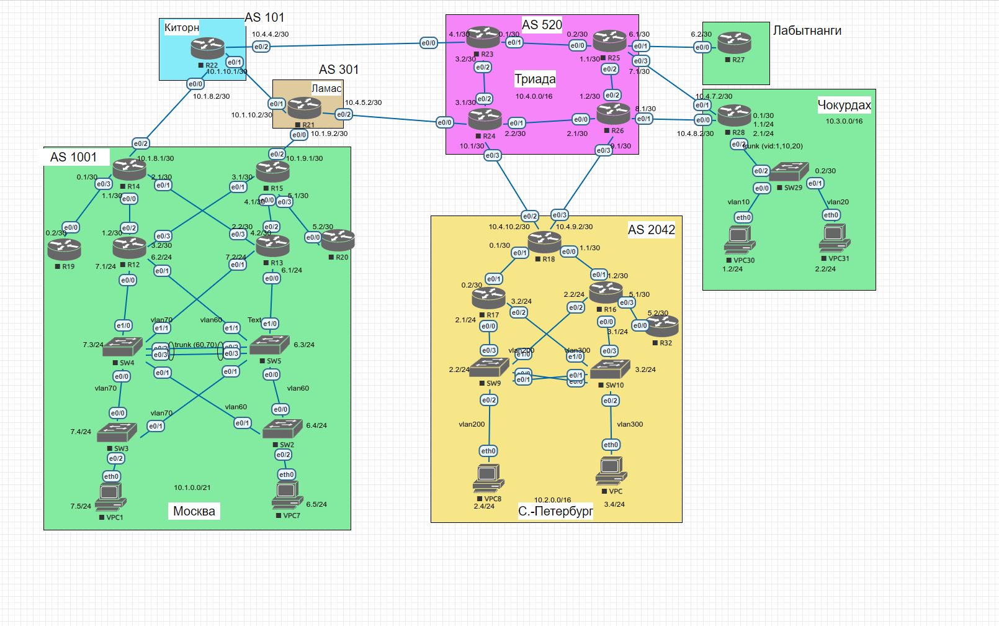

# Проектирование сети

## Цель:
- В данной самостоятельной работе необходимо распланировать адресное пространство
- Настроить IP на всех активных портах для дальнейшей работы над проектом
- Адресное пространство должно быть задокументировано

## Описание/Пошаговая инструкция выполнения домашнего задания:

- Разработать и задокументировать адресное пространство для лабораторного стенда.
- Настроить ip адреса на каждом активном порту
- Настроить каждый VPC в каждом офисе в своем VLAN.
- Настроить VLAN/Loopbackup interface управления для сетевых устройств
- Настроить сети офисов так, чтобы не возникало broadcast штормов, а использование линков было максимально оптимизировано

### Таблица с адресами интерфейсов:
<!-- rowspan в markdown нельзя... -->
<table>
<thead>
<tr>
<th>Устройство</th>
<th>Интерфейс</th>
<th>IP адрес</th>
</tr>
</thead>
<tbody>

<tr>
<td rowspan="4">R14</td>
<td>e0/0</td>
<td>10.1.1.1/30</td>
</tr>
<tr>
<td>e0/1</td>
<td>10.1.2.1/30</td>
</tr>
<tr>
<td>e0/2</td>
<td>10.1.8.1/30</td>
</tr>
<tr>
<td>e0/3</td>
<td>10.1.0.1/30</td>
</tr>

<tr>
<td rowspan="4">R15</td>
<td>e0/0</td>
<td>10.1.4.1/30</td>
</tr>
<tr>
<td>e0/1</td>
<td>10.1.3.1/30</td>
</tr>
<tr>
<td>e0/2</td>
<td>10.1.9.1/30</td>
</tr>
<tr>
<td>e0/3</td>
<td>10.1.5.1/30</td>
</tr>

<tr>
<td rowspan="4">R12</td>
<td>e0/0</td>
<td>10.1.7.1/24</td>
</tr>
<tr>
<td>e0/1</td>
<td>10.1.6.2/30</td>
</tr>
<tr>
<td>e0/2</td>
<td>10.1.1.2/30</td>
</tr>
<tr>
<td>e0/3</td>
<td>10.1.3.2/30</td>
</tr>

<tr>
<td rowspan="4">R13</td>
<td>e0/0</td>
<td>10.1.6.1/24</td>
</tr>
<tr>
<td>e0/1</td>
<td>10.1.7.2/30</td>
</tr>
<tr>
<td>e0/2</td>
<td>10.1.4.2/30</td>
</tr>
<tr>
<td>e0/3</td>
<td>10.1.2.2/30</td>
</tr>

<tr>
<td>R19</td>
<td>e0/0</td>
<td>10.1.0.2/30</td>
</tr>

<tr>
<td>R20</td>
<td>e0/0</td>
<td>10.1.5.2/30</td>
</tr>

<tr>
<td>SW4</td>
<td></td>
<td>10.1.7.3/24</td>
</tr>
<tr>
<td>SW5</td>
<td></td>
<td>10.1.7.3/24</td>
</tr>
<tr>
<td>SW4</td>
<td></td>
<td>10.1.6.3/24</td>
</tr>
<tr>
<td>SW3</td>
<td></td>
<td>10.1.7.4/24</td>
</tr>
<tr>
<td>SW2</td>
<td></td>
<td>10.1.6.4/24</td>
</tr>
<tr>
<td>VPC1</td>
<td>ETH</td>
<td>10.1.7.5/24</td>
</tr>
<tr>
<td>VPC2</td>
<td>ETH</td>
<td>10.1.6.5/24</td>
</tr>

<tr>
<td rowspan="3">R21</td>
<td>e0/0</td>
<td>10.1.9.2/30</td>
</tr>
<tr>
<td>e0/1</td>
<td>10.1.10.2/30</td>
</tr>
<tr>
<td>e0/2</td>
<td>10.4.5.2/30</td>
</tr>

<tr>
<td rowspan="3">R22</td>
<td>e0/0</td>
<td>10.1.8.2/30</td>
</tr>
<tr>
<td>e0/1</td>
<td>10.1.10.1/30</td>
</tr>
<tr>
<td>e0/2</td>
<td>10.4.4.2/30</td>
</tr>

<tr>
<td rowspan="3">R23</td>
<td>e0/0</td>
<td>10.4.4.1/30</td>
</tr>
<tr>
<td>e0/1</td>
<td>10.4.0.1/30</td>
</tr>
<tr>
<td>e0/2</td>
<td>10.4.3.2/30</td>
</tr>

<tr>
<td rowspan="4">R24</td>
<td>e0/0</td>
<td>10.4.5.1/30</td>
</tr>
<tr>
<td>e0/1</td>
<td>10.4.2.2/30</td>
</tr>
<tr>
<td>e0/2</td>
<td>10.4.3.1/30</td>
</tr>
<tr>
<td>e0/3</td>
<td>10.4.10.1/30</td>
</tr>

<tr>
<td rowspan="4">R25</td>
<td>e0/0</td>
<td>10.4.0.2/30</td>
</tr>
<tr>
<td>e0/1</td>
<td>10.4.6.1/30</td>
</tr>
<tr>
<td>e0/2</td>
<td>10.4.1.1/30</td>
</tr>
<tr>
<td>e0/3</td>
<td>10.4.7.1/30</td>
</tr>

<tr>
<td rowspan="4">R26</td>
<td>e0/0</td>
<td>10.4.2.1/30</td>
</tr>
<tr>
<td>e0/1</td>
<td>10.4.8.1/30</td>
</tr>
<tr>
<td>e0/2</td>
<td>10.4.1.2/30</td>
</tr>
<tr>
<td>e0/3</td>
<td>10.4.9.1/30</td>
</tr>

<tr>
<td>R27</td>
<td>e0/0</td>
<td>10.4.6.2/30</td>
</tr>

<tr>
<td rowspan="5">R28</td>
<td>e0/0</td>
<td>10.4.8.2/30</td>
</tr>
<tr>
<td>e0/1</td>
<td>10.4.7.2/30</td>
</tr>
<tr>
<td>e0/2</td>
<td>10.3.0.1/30</td>
</tr>
<tr>
<td>e0/2.10</td>
<td>10.3.1.1/24</td>
</tr>
<tr>
<td>e0/2.20</td>
<td>10.3.2.1/24</td>
</tr>

<tr>
<td>SW29</td>
<td>vlan1</td>
<td>10.3.0.2/30</td>
</tr>
<tr>
<td>VPC30</td>
<td>eth</td>
<td>10.3.1.2/24</td>
</tr>
<tr>
<td>VPC31</td>
<td>eth</td>
<td>10.3.2.2/24</td>
</tr>

<tr>
<td rowspan="4">R18</td>
<td>e0/0</td>
<td>10.2.1.1/30</td>
</tr>
<tr>
<td>e0/1</td>
<td>10.2.0.1/30</td>
</tr>
<tr>
<td>e0/2</td>
<td>10.4.10.2/30</td>
</tr>
<tr>
<td>e0/3</td>
<td>10.4.9.2/30</td>
</tr>

<tr>
<td rowspan="3">R17</td>
<td>e0/0</td>
<td>10.2.2.1/24</td>
</tr>
<tr>
<td>e0/1</td>
<td>10.2.0.2/30</td>
</tr>
<tr>
<td>e0/2</td>
<td>10.42.3.2/24</td>
</tr>

<tr>
<td rowspan="4">R16</td>
<td>e0/0</td>
<td>10.2.3.1/24</td>
</tr>
<tr>
<td>e0/1</td>
<td>10.2.1.2/30</td>
</tr>
<tr>
<td>e0/2</td>
<td>10.2.2.2/24</td>
</tr>
<tr>
<td>e0/3</td>
<td>10.2.5.1/30</td>
</tr>

<tr>
<td>R32</td>
<td>e0/0</td>
<td>10.2.5.2/30</td>
</tr>

<tr>
<td>SW9</td>
<td></td>
<td>10.2.2.3/24</td>
</tr>

<tr>
<td>SW10</td>
<td></td>
<td>10.2.3.3/24</td>
</tr>

<tr>
<td>VPC8</td>
<td>eth</td>
<td>10.2.2.4/24</td>
</tr>

<tr>
<td>VPC</td>
<td>eth</td>
<td>10.2.3.4/24</td>
</tr>

### Визуальная схема адресации:
