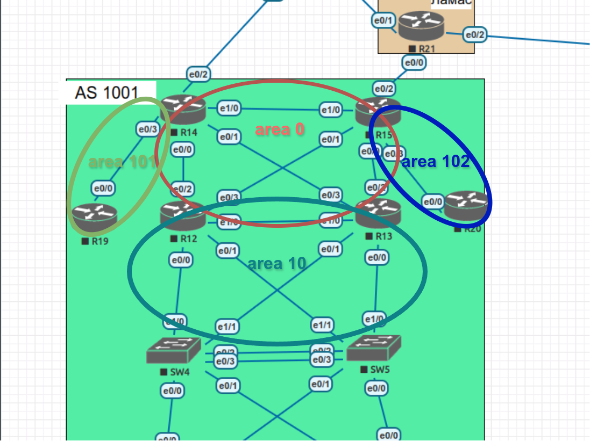

# OSPF

## Цель:
- Настроить OSPF офисе Москва
- Разделить сеть на зоны
- Настроить фильтрацию между зонами


## Описание/Пошаговая инструкция выполнения домашнего задания:
- Маршрутизаторы R14-R15 находятся в зоне 0 - backbone.
- Маршрутизаторы R12-R13 находятся в зоне 10. Дополнительно к маршрутам должны получать маршрут по умолчанию.
- Маршрутизатор R19 находится в зоне 101 и получает только маршрут по умолчанию.
- Маршрутизатор R20 находится в зоне 102 и получает все маршруты, кроме маршрутов до сетей зоны 101.

## Выполнение

### Схема расположения зон OSPF



### Добавление линков и назначение адресов
Для повышения отказоустойчивости создадим дополнительные линки между роутерами R14 и R15, а также между R12 и R13.  
Назначим адресацию поднятым интерфейсам (подсети 10.1.0.4/30 и 10.1.0.8/30 соответственно):
```
R14(config-if)#ip address 10.1.0.5 255.255.255.252

R15(config-if)#ip address 10.1.0.6 255.255.255.252

R12(config-if)#ip address 10.1.0.9 255.255.255.252

R13(config-if)#ip address 10.1.0.10 255.255.255.252
```

### Включение OSPF на роутерах и назначение зон интерфейсам:
R14 - интерфейсы к R15, R12, R13 - area 0, к R19 - area 101:
```
R14(config)#router ospf 1
R14(config-router)#router-id 14.14.14.14
R14(config)#int range e1/0,e0/0-1
R14(config-if-range)#ip ospf 1 area 0
R14(config)#int e0/3
R14(config-if)#ip ospf 1 area 101
```
R15 - интерфейсы к R14, R12, R13 - area 0, к R20 - area 102:
```
R15(config)#router ospf 1
R15(config-router)#router-id 15.15.15.15
R15(config)#int range e1/0,e0/0-1
R15(config-if-range)#ip ospf 1 area 0
R15(config-if-range)#int e0/3
R15(config-if)#ip ospf 1 area 102
```
R12 - интерфейсы к R14, R15 - area 0, к R13 и в интерфесы с сетями 10.1.6.0/24 и 10.1.7.0/24 - area 10:
```
R12(config)#router ospf 1
R12(config-router)#router-id 12.12.12.12
R12(config-router)#network 10.1.6.0 0.0.0.255 area 10
R12(config-router)#network 10.1.7.0 0.0.0.255 area 10
R12(config)#int range e0/2-3
R12(config-if-range)#ip ospf 1 area 0
R12(config-if-range)#int range e1/0,e0/0-1
R12(config-if-range)#ip ospf 1 area 10
```
R13 - интерфейсы к R14, R15 - area 0, к R14 и в интерфесы с сетями 10.1.6.0/24 и 10.1.7.0/24 - area 10:
```
R13(config)#router ospf 1
R13(config-router)#router-id 13.13.13.13
R13(config-router)#network 10.1.6.0 0.0.0.255 area 10
R13(config-router)#network 10.1.7.0 0.0.0.255 area 10
R13(config)#int range e0/2-3
R13(config-if-range)#ip ospf 1 area 0
R13(config-if-range)#int range e1/0,e0/0-1
R13(config-if-range)#ip ospf 1 area 10
```
R19:
```
R19(config)#router ospf 1
R19(config-router)#router-id 19.19.19.19
R19(config)#int e0/0
R19(config-if)#ip ospf 1 area 101
```
R20:
```
R20(config)#router ospf 1
R20(config-router)#router-id 20.20.20.20
R20(config)#int e0/0
R20(config-if)#ip ospf 1 area 102
```


### Настройка дополнительно к маршрутам получение маршрута по умолчанию на R12, R13:

Для этого переведем зону area 10 в тип stub:

```
R12(config)#router ospf 1
R12(config-router)#area 10 stub

R13(config)#router ospf 1
R13(config-router)#area 10 stub
```


### Настройка фильтрации


Для area 101 дополнительно настраиваем зону как totally stub, чтобы она получала только маршрут по-умолчанию:
```
R14(config)#router ospf 1
R14(config-router)#area 101 stub no-summary

R19(config)#router ospf 1
R19(config-router)#area 101 stub
```


Чтобы запретить на R20 маршруты из сети area 101 будем использовать фильтрацию на роутере R15:
```
R15(config)#ip prefix-list area_101 deny 10.1.0.0/30
R15(config)#ip prefix-list area_101 permit 0.0.0.0/0 le 32
R15(config)#router ospf 1
R15(config-router)#area 102 filter-list prefix area_101 in
```

Проверка на R20 (есть все записи, кроме записи о сети 10.1.0.0/30):
```
R20#sh ip ospf database

            OSPF Router with ID (20.20.20.20) (Process ID 1)

                Router Link States (Area 102)

Link ID         ADV Router      Age         Seq#       Checksum Link count
15.15.15.15     15.15.15.15     8           0x80000006 0x006423 1
20.20.20.20     20.20.20.20     7           0x80000003 0x00F76A 1

                Net Link States (Area 102)

Link ID         ADV Router      Age         Seq#       Checksum
10.1.5.1        15.15.15.15     8           0x80000001 0x00E57D

                Summary Net Link States (Area 102)

Link ID         ADV Router      Age         Seq#       Checksum
10.1.0.4        15.15.15.15     799         0x80000001 0x006189
10.1.0.8        15.15.15.15     400         0x80000001 0x009D3F
10.1.1.0        15.15.15.15     475         0x80000001 0x00E201
10.1.2.0        15.15.15.15     400         0x80000001 0x00D70B
10.1.3.0        15.15.15.15     475         0x80000001 0x006883
10.1.4.0        15.15.15.15     400         0x80000001 0x005D8D
10.1.6.0        15.15.15.15     400         0x80000001 0x00BD1E
10.1.7.0        15.15.15.15     400         0x80000001 0x00B228

                Summary ASB Link States (Area 102)

Link ID         ADV Router      Age         Seq#       Checksum
12.12.12.12     15.15.15.15     475         0x80000001 0x00F1D3
13.13.13.13     15.15.15.15     400         0x80000001 0x00C3FD
14.14.14.14     15.15.15.15     799         0x80000001 0x009528

                Type-5 AS External Link States

Link ID         ADV Router      Age         Seq#       Checksum Tag
0.0.0.0         12.12.12.12     522         0x80000001 0x00C1AA 1
0.0.0.0         13.13.13.13     445         0x80000001 0x00CA9A 1
0.0.0.0         14.14.14.14     844         0x80000001 0x0095E4 1
0.0.0.0         15.15.15.15     936         0x80000001 0x0077FE 1
0.0.0.0         20.20.20.20     15          0x80000001 0x000543 1
```