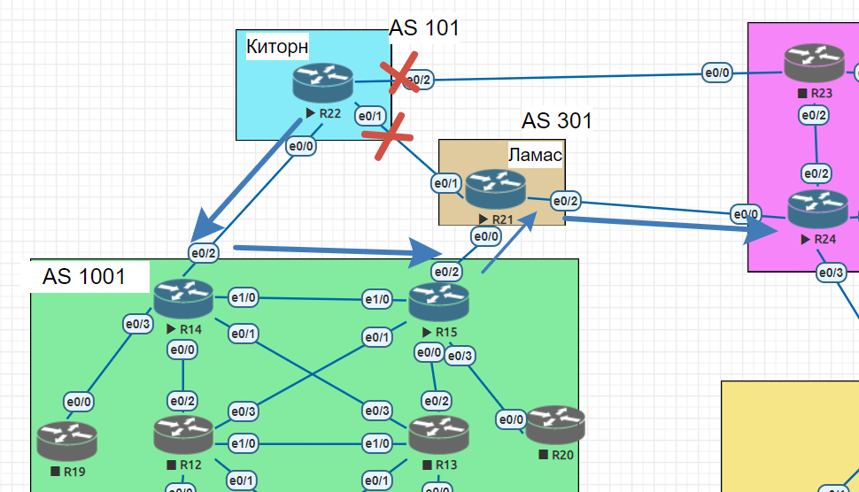
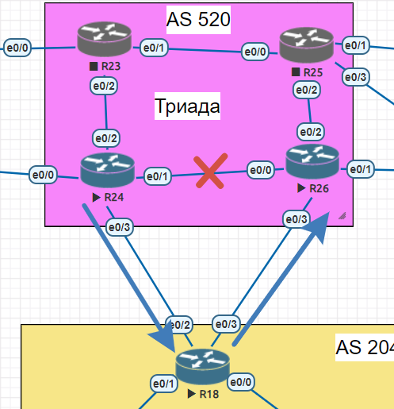

# BGP. Фильтрация

## Цель:
- Настроить фильтрацию для офисе Москва
- Настроить фильтрацию для офисе С.-Петербург

## Описание/Пошаговая инструкция выполнения домашнего задания:

- Настроить фильтрацию в офисе Москва так, чтобы не появилось транзитного трафика(As-path).
- Настроить фильтрацию в офисе С.-Петербург так, чтобы не появилось транзитного трафика(Prefix-list).
- Настроить провайдера Киторн так, чтобы в офис Москва отдавался только маршрут по умолчанию.
- Настроить провайдера Ламас так, чтобы в офис Москва отдавался только маршрут по умолчанию и префикс офиса С.-Петербург.
- Все сети в лабораторной работе должны иметь IP связность.

## Выполнение

### Настроить фильтрацию в офисе Москва так, чтобы не появилось транзитного трафика(As-path)

Для такой фильтрации настроим на роутерах R14 и R15 аксес-листы, разрешающие выходить только трафику из локальной АС:

```
R14(config)#ip as-path access-list 1 permit ^$
R14(config)#ip as-path access-list 1 deny .*
R14(config-router)#neighbor 10.1.8.2 filter-list 1 out

R15(config)#ip as-path access-list 1 permit ^$
R15(config)#ip as-path access-list 1 deny .*
R15(config-router)#neighbor 10.1.9.2 filter-list 1 out
```

Для проверки оргнаизуем такую схему (на R22 выключим все интерфейсы, кроме линка до R14 и будем пинговать R24):  


Сначала покажем ситуацию ДО применения фильтрации. Удостоверимся, что трафик проходит, и приходит именно через Москву:
```
R22#ping 10.4.5.1
Type escape sequence to abort.
Sending 5, 100-byte ICMP Echos to 10.4.5.1, timeout is 2 seconds:
!!!!!
Success rate is 100 percent (5/5), round-trip min/avg/max = 1/1/1 ms

R22#traceroute 10.4.5.1
Type escape sequence to abort.
Tracing the route to 10.4.5.1
VRF info: (vrf in name/id, vrf out name/id)
  1 10.1.8.1 0 msec 0 msec 0 msec
  2 10.1.0.6 [AS 1001] 0 msec 1 msec 0 msec
  3 10.1.9.2 [AS 301] 0 msec 1 msec 0 msec
  4 10.4.5.1 [AS 301] 0 msec *  0 msec
```

После применения фильтрации трафик перестал проходить:
```
R22#ping 10.4.5.1
Type escape sequence to abort.
Sending 5, 100-byte ICMP Echos to 10.4.5.1, timeout is 2 seconds:
.....
Success rate is 0 percent (0/5)
```

### Настроить фильтрацию в офисе С.-Петербург так, чтобы не появилось транзитного трафика(Prefix-list)

Для этого разрешим анонсить только адресное пространоство С.-Петербурга с помощью префикс-листов:
```
R18(config)#ip prefix-list LIST_IN permit 10.2.0.0/16
R18(config)#ip prefix-list LIST_IN deny 0.0.0.0/0 le 32

R18(config-router)# neighbor 10.4.9.1 prefix-list LIST_IN out
R18(config-router)# neighbor 10.4.10.1 prefix-list LIST_IN out
```

Для проверки организуем аналогичную схему (как в предыдущем пункте):



 
Аналогично, сначала покажем ситуацию ДО применения фильтрации:
```
R24#ping 10.4.9.1
Type escape sequence to abort.
Sending 5, 100-byte ICMP Echos to 10.4.9.1, timeout is 2 seconds:
!!!!!
Success rate is 100 percent (5/5), round-trip min/avg/max = 4/4/5 ms
```
и после:
```
R24#ping 10.4.9.1
Type escape sequence to abort.
Sending 5, 100-byte ICMP Echos to 10.4.9.1, timeout is 2 seconds:
.....
Success rate is 0 percent (0/5)
```
### Настроить провайдера Киторн так, чтобы в офис Москва отдавался только маршрут по умолчанию

Сделаем соответствующую настройку на R22:


```
R22(config)#ip prefix-list DEFAULT permit 0.0.0.0/0
R22(config-router)#neighbor 10.1.8.1 default-originate
R22(config-router)#neighbor 10.1.8.1 pre
R22(config-router)#neighbor 10.1.8.1 prefix-list DEFAULT out
```

Полученные роутером R14 маршруты ДО применения фильтрации:
```
R14#sh ip bgp
<...>
     Network          Next Hop            Metric LocPrf Weight Path
 * i 10.1.0.0/21      10.1.0.6                 0    100    500 i
 *>                   0.0.0.0                  0         32768 i
 r>  10.1.8.0/30      10.1.8.2                 0             0 101 i
 *   10.1.9.0/30      10.1.8.2                               0 101 301 i
 *>i                  10.1.0.6                 0    100    500 301 i
 *   10.1.10.0/30     10.1.8.2                 0             0 101 i
 *>i                  10.1.0.6                 0    100    500 301 i
 *   10.2.0.0/16      10.1.8.2                               0 101 301 520 2042 i
<...>
 ```
и после (от R22(10.1.8.2) теперь только один маргрут 0.0.0.0):
```
R14#sh ip bgp
<...>
     Network          Next Hop            Metric LocPrf Weight Path
 r>  0.0.0.0          10.1.8.2                               0 101 i
 * i 10.1.0.0/21      10.1.0.6                 0    100    500 i
 *>                   0.0.0.0                  0         32768 i
 r>i 10.1.8.0/30      10.1.0.6                 0    100    500 301 101 i
 *>i 10.1.9.0/30      10.1.0.6                 0    100    500 301 i
 *>i 10.1.10.0/30     10.1.0.6                 0    100    500 301 i
 *>i 10.2.0.0/16      10.1.0.6                 0    100    500 301 520 2042 i
 *>i 10.3.0.0/16      10.1.0.6                 0    100    500 301 520 i
<...>
```


### Настроить провайдера Ламас так, чтобы в офис Москва отдавался только маршрут по умолчанию и префикс офиса С.-Петербург

Сделаем настройки, аналогичным способом на роутере R21, но также разрешим сеть С.-Петербурга (10.2.0.0/16):
```
R21(config)#ip prefix-list DEFAULT permit 0.0.0.0/0
R21(config)#ip prefix-list DEFAULT permit 10.2.0.0/16

R21(config-router)#neighbor 10.1.9.1 default-originate
R21(config-router)#neighbor 10.1.9.1 pre
R21(config-router)#neighbor 10.1.9.1 prefix-list DEFAULT ou
R21(config-router)#neighbor 10.1.9.1 prefix-list DEFAULT out
```

Ситуация на R15 ДО применения фильтрации:
```
R15#sh ip bgp
BGP table version is 36, local router ID is 15.15.15.15
Status codes: s suppressed, d damped, h history, * valid, > best, i - internal,
              r RIB-failure, S Stale, m multipath, b backup-path, f RT-Filter,
              x best-external, a additional-path, c RIB-compressed,
Origin codes: i - IGP, e - EGP, ? - incomplete
RPKI validation codes: V valid, I invalid, N Not found

     Network          Next Hop            Metric LocPrf Weight Path
 r>i 0.0.0.0          10.1.0.5                 0    100      0 101 i
 * i 10.1.0.0/21      10.1.0.5                 0    100      0 i
 *>                   0.0.0.0                  0         32768 i
 *>  10.1.8.0/30      10.1.9.2                               0 301 101 i
 r>  10.1.9.0/30      10.1.9.2                 0             0 301 i
 *>  10.1.10.0/30     10.1.9.2                 0             0 301 i
 *>  10.2.0.0/16      10.1.9.2                               0 301 520 2042 i
 *>  10.3.0.0/16      10.1.9.2                               0 301 520 i
 *>  10.4.1.0/30      10.1.9.2                               0 301 520 i
 *>  10.4.2.0/30      10.1.9.2                               0 301 520 i
 *>  10.4.3.0/30      10.1.9.2                               0 301 520 i
 *>  10.4.4.0/30      10.1.9.2                               0 301 101 i
 *>  10.4.5.0/30      10.1.9.2                 0             0 301 i
 *>  10.4.8.0/30      10.1.9.2                               0 301 520 i
```

и после:

```
R15#sh ip bgp
BGP table version is 49, local router ID is 15.15.15.15
Status codes: s suppressed, d damped, h history, * valid, > best, i - internal,
              r RIB-failure, S Stale, m multipath, b backup-path, f RT-Filter,
              x best-external, a additional-path, c RIB-compressed,
Origin codes: i - IGP, e - EGP, ? - incomplete
RPKI validation codes: V valid, I invalid, N Not found

     Network          Next Hop            Metric LocPrf Weight Path
 *>  0.0.0.0          10.1.9.2                               0 301 i
 * i 10.1.0.0/21      10.1.0.5                 0    100      0 i
 *>                   0.0.0.0                  0         32768 i
 *>  10.2.0.0/16      10.1.9.2                               0 301 520 2042 i
```


### Все сети в лабораторной работе должны иметь IP связность

Удостоверимся, что связность не потерялась. Проверим доступность из Москвы доступность R26 (интерфейса, смотрящего на С.-Петербург): 

```
R15#ping 10.4.9.1
Type escape sequence to abort.
Sending 5, 100-byte ICMP Echos to 10.4.9.1, timeout is 2 seconds:
!!!!!
Success rate is 100 percent (5/5), round-trip min/avg/max = 1/1/1 ms
```